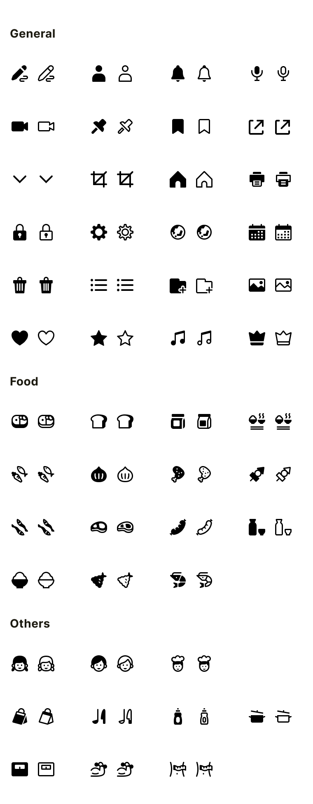

# Apron Icons

Unofficial Flutter package for **Cookpad's Apron UI Kit icons**. Apron UI Kit is made by [Cookpad](https://www.figma.com/@cookpad) and licensed under [CC BY 4.0](https://creativecommons.org/licenses/by/4.0/).

## Installation

Add `apron_icons` dependency to your Flutter project:

```yaml
dependencies:
  apron_icons: ^<latest-version>
```

### Installation (Local)

If you purchased this package from marketplace, follow instructions below to use this package:

1. Put `apron_icons` package folder in the same folder as your Flutter project like shown below:
   ```
   └── my_working_directory/
       ├── apron_icons/                     # Place package folder here
       └── my_awesome_flutter_project/      # Place your Flutter project folder here
   ```
2. In your `pubspec.yaml` file, add `apron_icons` as local dependency in your Flutter project:
   ```yaml
   dependencies:
     apron_icons:
       path: ../apron_icons
   ```
3. Update your Flutter project dependencies by running:
   ```
   flutter pub get
   ```

## Usage

Import the package in your Flutter file and use one of these 2 alternatives to display your icons:

```dart
import 'package:apron_icons/apron_icons.dart';

/// Alternative 1 - Using Icon widget:
Icon _icon = Icon(ApronIcons.sidedish, size: 24.0);

/// Alternative 2 - Using ApronIcon widget:
Icon _icon = ApronIcon(ApronIcons.sidedish);
```

## Issues

For issues, file directly in the [repository](https://github.com/hanmajid/apron_icons/issues).

## Icons



All Apron icons can be viewed on its Figma file [here](https://www.figma.com/community/file/847372282968994272).

## Find this library useful? ❤️

Support it by joining __[stargazers](https://github.com/hanmajid/apron_icons/stargazers)__ for this repository. ⭐️ <br>
Also, __[follow me](https://github.com/hanmajid)__ on GitHub for my next project! 🐱

## License

```xml
Copyright 2023 hanmajid (Muhammad Farhan Majid)

Licensed under the Apache License, Version 2.0 (the "License");
you may not use this file except in compliance with the License.
You may obtain a copy of the License at

   http://www.apache.org/licenses/LICENSE-2.0

Unless required by applicable law or agreed to in writing, software
distributed under the License is distributed on an "AS IS" BASIS,
WITHOUT WARRANTIES OR CONDITIONS OF ANY KIND, either express or implied.
See the License for the specific language governing permissions and
limitations under the License.
```